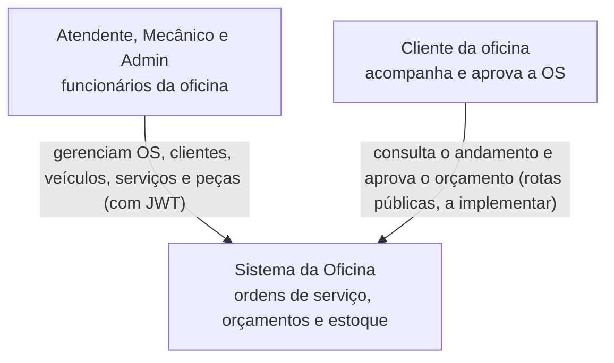
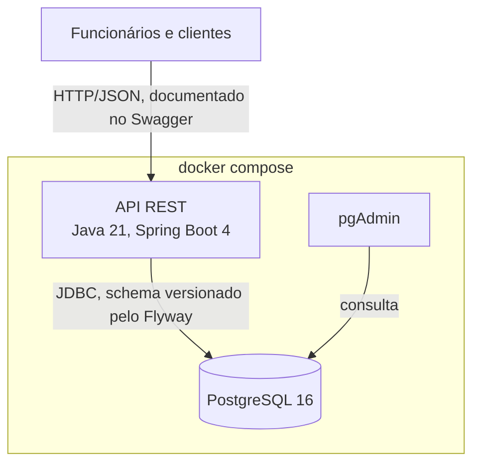

# Diagramas C4

O modelo C4 descreve a arquitetura em níveis de zoom. Aqui estão os dois primeiros: quem usa o sistema (contexto) e as partes que rodam (contêineres).

## Nível 1: contexto

## Nível 2: contêineres

